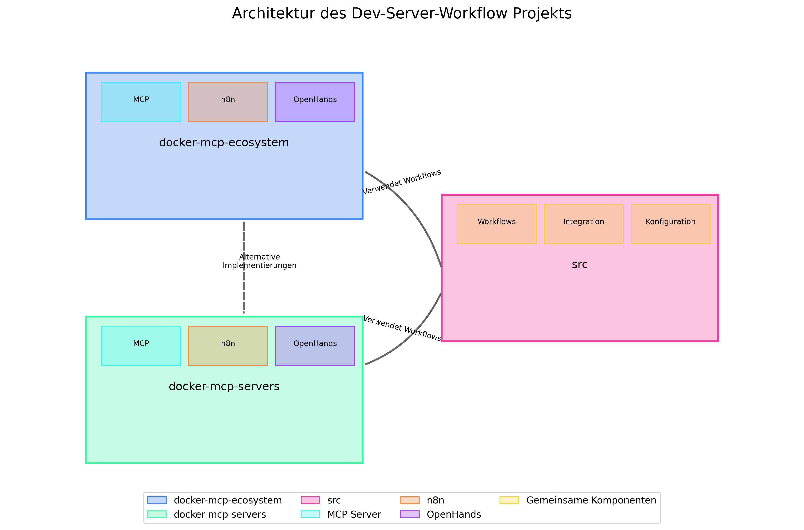

# Architektur und Komponenten des Dev-Server-Workflow Projekts

Dieses Dokument beschreibt die Architektur des Dev-Server-Workflow Projekts, die Beziehungen zwischen den verschiedenen Komponenten und gibt Empfehlungen, welche Implementierung für welchen Anwendungsfall zu verwenden ist.

## Überblick über die Architektur

Das Dev-Server-Workflow Projekt besteht aus drei Hauptkomponenten:

1. **docker-mcp-ecosystem**: Eine umfassende Implementierung des gesamten MCP-Server-Ökosystems mit n8n, Monitoring und OpenHands-Integration
2. **docker-mcp-servers**: Eine fokussierte Implementierung nur der MCP-Server ohne zusätzliche Komponenten
3. **src**: Quellcode für die Integration und Konfiguration, insbesondere n8n-Workflow-Definitionen

## Beziehungen zwischen den Komponenten

### docker-mcp-ecosystem und docker-mcp-servers

Diese beiden Verzeichnisse enthalten **alternative Implementierungen** des MCP-Server-Ökosystems:

- **docker-mcp-ecosystem** ist die umfassendere Lösung, die alle Komponenten enthält:
  - MCP-Server (Filesystem, Desktop Commander, GitHub, etc.)
  - n8n für Workflow-Automatisierung
  - Monitoring-Tools (Grafana, Prometheus)
  - OpenHands-Integration
  - Umfangreiche Konfigurationsmöglichkeiten

- **docker-mcp-servers** ist eine schlankere Version, die sich auf die Kernfunktionalität der MCP-Server konzentriert:
  - Nur die MCP-Server selbst
  - Minimale Konfiguration
  - Einfachere Einrichtung

**Wichtig**: Diese beiden Implementierungen sind nicht dafür ausgelegt, gleichzeitig zu laufen, da sie die gleichen Ports und Container-Namen verwenden.

### src und die Docker-Implementierungen

Das `src`-Verzeichnis enthält den Quellcode für die Integration und Konfiguration:

- **n8n-Workflow-Definitionen**: Diese werden von beiden Docker-Implementierungen verwendet
- **Integrationsskripte**: Skripte zur Integration von MCP-Servern mit n8n und OpenHands
- **Konfigurationsvorlagen**: Vorlagen für die Konfiguration der verschiedenen Komponenten

Die Docker-Implementierungen verwenden die Workflow-Definitionen aus dem `src`-Verzeichnis, insbesondere aus dem Unterverzeichnis `src/ESN_Initial-Szenario/n8n-workflows`.

## Welche Implementierung sollte ich verwenden?

### Verwenden Sie docker-mcp-ecosystem, wenn Sie:

- Das gesamte Ökosystem mit allen Komponenten benötigen
- n8n für Workflow-Automatisierung verwenden möchten
- Monitoring und Logging benötigen
- Eine umfassende OpenHands-Integration wünschen
- Mehrere Integrationen gleichzeitig verwenden möchten

### Verwenden Sie docker-mcp-servers, wenn Sie:

- Nur die MCP-Server selbst benötigen
- Eine schlankere, ressourcenschonendere Lösung suchen
- Die MCP-Server mit einer bestehenden n8n-Installation integrieren möchten
- Eine einfachere Einrichtung bevorzugen
- Nur bestimmte MCP-Server benötigen

### Verwenden Sie src direkt, wenn Sie:

- Eigene Workflows entwickeln möchten
- Die Integrationen anpassen möchten
- Die Konfiguration programmatisch erstellen möchten
- Spezifische Komponenten in Ihre eigene Infrastruktur integrieren möchten

## Gemeinsame Konfiguration und Modularität

### Gemeinsame Konfigurationsdateien

Beide Docker-Implementierungen verwenden ähnliche Konfigurationsstrukturen:

- **.env-Dateien**: Umgebungsvariablen für die Konfiguration
- **docker compose.yml**: Definition der Docker-Container
- **Skripte**: Start-, Stopp- und Monitoring-Skripte

### Modulare Struktur

Die Implementierungen sind modular aufgebaut:

- **MCP-Server**: Jeder MCP-Server ist ein eigenständiger Container
- **n8n**: n8n ist ein eigenständiger Container, der mit den MCP-Servern kommuniziert
- **Monitoring**: Die Monitoring-Tools sind eigenständige Container
- **OpenHands-Integration**: Die OpenHands-Integration ist modular und kann separat konfiguriert werden

## Automatisierte Tests

Das Projekt enthält automatisierte Tests, um sicherzustellen, dass die Implementierungen korrekt funktionieren:

- **test-mcp-servers.py**: Testet die MCP-Server
- **test-workflows.py**: Testet die n8n-Workflows
- **monitor-mcp-servers.py**: Überwacht den Status der MCP-Server

## Empfehlungen für die Weiterentwicklung

1. **Gemeinsame Konfigurationsbasis**: Entwickeln Sie eine gemeinsame Konfigurationsbasis für beide Implementierungen
2. **Modulare Docker-Compose-Dateien**: Gestalten Sie die Docker-Compose-Dateien modular, um Redundanz zu vermeiden
3. **Automatisierte Tests erweitern**: Erweitern Sie die automatisierten Tests, um alle Komponenten abzudecken
4. **Dokumentation verbessern**: Halten Sie die Dokumentation aktuell und fügen Sie Beispiele für verschiedene Anwendungsfälle hinzu

## Fazit

Das Dev-Server-Workflow Projekt bietet flexible Implementierungen für verschiedene Anwendungsfälle. Durch die Wahl der richtigen Implementierung können Sie die Vorteile des Projekts optimal nutzen und gleichzeitig den Ressourcenverbrauch minimieren.

Für die meisten Anwendungsfälle empfehlen wir die Verwendung von `docker-mcp-ecosystem`, da es die umfassendste Lösung bietet und alle Komponenten enthält. Wenn Sie jedoch nur die MCP-Server benötigen oder eine schlankere Lösung suchen, ist `docker-mcp-servers` die bessere Wahl.