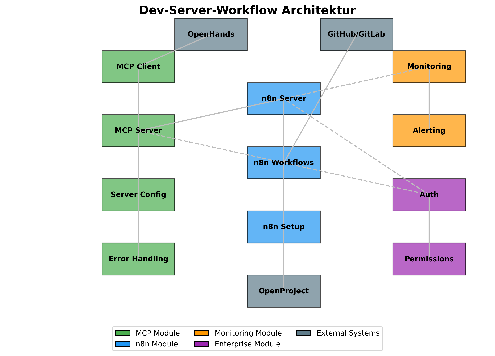
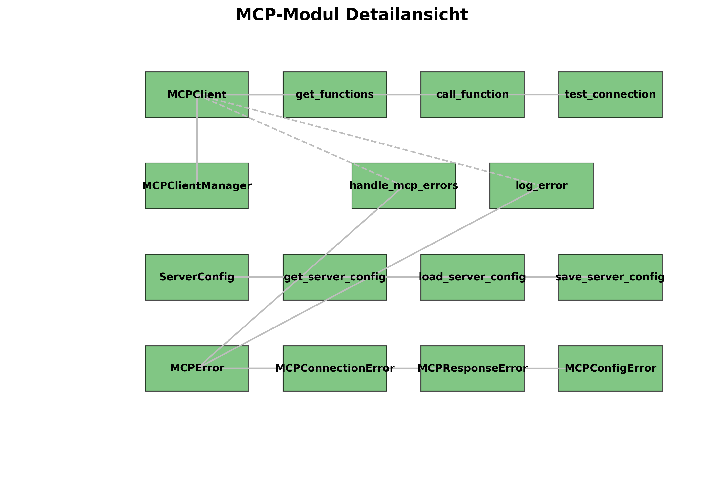

# Architekturdiagramme

Dieses Dokument enthält Architekturdiagramme für das Dev-Server-Workflow-Projekt, die die Beziehungen zwischen den verschiedenen Komponenten visualisieren.

## Gesamtarchitektur

Das Architekturdiagramm zeigt die Hauptkomponenten des Dev-Server-Workflow-Projekts und ihre Beziehungen zueinander:

### MCP-Module (Grün)
- **MCP Client**: Client für die Kommunikation mit MCP-Servern
- **MCP Server**: Server, der das Model Context Protocol implementiert
- **Server Config**: Konfiguration für MCP-Server
- **Error Handling**: Fehlerbehandlung für MCP-Operationen

### n8n-Module (Blau)
- **n8n Server**: n8n-Server, der Workflows ausführt
- **n8n Workflows**: Workflows für die Integration verschiedener Tools
- **n8n Setup**: Skripte für die Installation und Konfiguration von n8n

### Monitoring-Module (Orange)
- **Monitoring**: Überwachung der MCP-Server und n8n-Server
- **Alerting**: Benachrichtigungen bei Problemen

### Enterprise-Module (Lila)
- **Auth**: Authentifizierung und Autorisierung
- **Permissions**: Berechtigungsverwaltung

### Externe Systeme (Grau-Blau)
- **OpenHands**: KI-gestützte Issue-Lösung
- **GitHub/GitLab**: Code-Repository
- **OpenProject**: Projektmanagement

Die Verbindungen zwischen den Komponenten zeigen die Abhängigkeiten und Kommunikationswege. Durchgezogene Linien stellen direkte Abhängigkeiten dar, während gestrichelte Linien optionale oder indirekte Abhängigkeiten darstellen.

## MCP-Modul Detailansicht

Das Detaildiagramm für das MCP-Modul zeigt die internen Komponenten und ihre Beziehungen:

### Klassen
- **MCPClient**: Client für die Kommunikation mit einem MCP-Server
- **MCPClientManager**: Manager für mehrere MCP-Clients
- **ServerConfig**: Konfiguration für MCP-Server
- **MCPError**: Basisklasse für MCP-Fehler
- **MCPConnectionError**: Fehler bei der Verbindung zu einem MCP-Server
- **MCPResponseError**: Fehler in der Antwort eines MCP-Servers
- **MCPConfigError**: Fehler in der MCP-Konfiguration

### Funktionen
- **get_functions**: Ruft die verfügbaren Funktionen eines MCP-Servers ab
- **call_function**: Ruft eine Funktion eines MCP-Servers auf
- **test_connection**: Testet die Verbindung zu einem MCP-Server
- **get_server_config**: Ruft die MCP-Server-Konfiguration ab
- **load_server_config**: Lädt die MCP-Server-Konfiguration aus einer Datei
- **save_server_config**: Speichert die MCP-Server-Konfiguration in einer Datei
- **handle_mcp_errors**: Dekorator für die Fehlerbehandlung
- **log_error**: Protokolliert einen Fehler

Die Verbindungen zwischen den Komponenten zeigen die Abhängigkeiten und Kommunikationswege. Durchgezogene Linien stellen direkte Abhängigkeiten dar, während gestrichelte Linien optionale oder indirekte Abhängigkeiten darstellen.

## Verwendung der Diagramme

Diese Diagramme dienen als Referenz für Entwickler, die am Dev-Server-Workflow-Projekt arbeiten. Sie helfen dabei, die Struktur des Projekts zu verstehen und die Beziehungen zwischen den verschiedenen Komponenten zu visualisieren.

Die Diagramme sollten bei größeren Änderungen an der Architektur aktualisiert werden, um sicherzustellen, dass sie den aktuellen Stand des Projekts widerspiegeln.